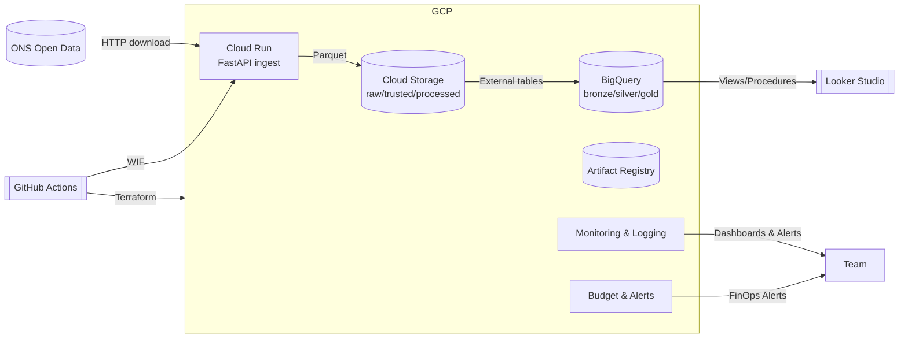

# Sauter Challenger — Plataforma de Dados e ML/Agentes na Google Cloud

> Monorepo oficial do desafio Sauter University 2025. O código e a infraestrutura aqui descritos habilitam ingestão diária dos dados de ENA do ONS, processamento em BigQuery, APIs Python servidas no Cloud Run e observabilidade ponta a ponta com FinOps.

## 📌 Resumo executivo
- **Escopo**: ingestão dos datasets públicos do ONS (ENA/Reservatórios), armazenamento versionado no GCS, modelagem em BigQuery, exposição via API FastAPI e dashboards analíticos no Looker Studio.
- **Entrega**: infraestrutura como código (Terraform + WIF), pipelines de ingestão com verificação de duplicidade, testes automatizados, documentação operacional e trilha de ML com card do modelo.
- **Trilhos**: o repositório suporta o trilho de **Modelo preditivo (Trilho A)** e fornece bases para o trilho de **Agentes RAG (Trilho B)**.

📚 **Documentação completa**: consulte [`docs/PROJECT_DOCUMENTATION.md`](docs/PROJECT_DOCUMENTATION.md) para o passo a passo detalhado de implementação, observabilidade, decisões arquiteturais, runbooks e changelog.

---

## 🗺️ Visão rápida da arquitetura



---

## 🚀 Guia rápido

### Pré-requisitos
- Python 3.11+
- [uv](https://github.com/astral-sh/uv) ou `pip` para instalar dependências
- Docker + Docker Compose (para execução local da API)
- Terraform 1.6+, `gcloud` CLI e permissões no projeto `sauter-university-challenger`

### Clonar e configurar
```bash
git clone https://github.com/sauter-university-challenge-ACFMV/sauter-university-2025-challenge.git
cd sauter-university-2025-challenge
cp src/api/.env.example src/api/.env  # ajuste variáveis locais
```

### Executar a API de ingestão (modo desenvolvimento)
```bash
docker-compose up --build
# acessar http://localhost:8000/docs
```

### Rodar testes e qualidade
```bash
uv pip install -r src/api/requirements.txt
pytest --maxfail=1 --disable-warnings -q
```

### Provisionar infraestrutura (ambiente `dev`)
```bash
cd src/infra/envs/dev
terraform init -backend-config=backend.hcl
terraform plan
terraform apply
```

Mais detalhes — inclusive rollback, deploy canário, observabilidade e runbooks — estão descritos na documentação completa.

---

## 🧱 Estrutura do repositório

```text
.
├── docs/                      # Guias, diagramas, PDFs técnicos
├── ml/specs/                  # Model card e contratos de ML
├── src/api/                   # API FastAPI para ingestão da ONS
│   ├── routers/               # Endpoints /ons/filter-parquet-files e bulk
│   ├── services/              # Lógica de download, deduplicação e upload GCS
│   ├── repositories/          # Adaptação GCS + BigQuery com autenticação WIF
│   ├── tests/                 # Testes unitários e de integração
│   └── .env.example           # Variáveis necessárias para execução local
├── src/infra/                 # Terraform modular (IAM, WIF, Run, BQ, GCS, Budget…)
├── sql/BQ/                    # Scripts ELT (raw → trusted → refined, procedures, views)
├── docker-compose.yml         # Orquestração local dos serviços
├── pyproject.toml             # Configuração de lint, mypy, pytest e coverage
└── docs/PROJECT_DOCUMENTATION.md  # Guia completo do projeto
```

---

## 🔍 Guias específicos
- **API de ingestão**: [`src/api/README.md`](src/api/README.md) documenta arquitetura de código, fluxos e contratos.
- **Infraestrutura Terraform**: [`src/infra/README.md`](src/infra/README.md) explica módulos, WIF e execução local.
- **Engenharia de Dados (BigQuery)**: [`sql/README.md`](sql/README.md) cobre camadas ELT, procedimentos e boas práticas.
- **Modelagem de ML**: [`ml/specs/README.md`](ml/specs/README.md) apresenta o model card da trilha A.
- **Dashboards e CI/CD**: PDFs em `docs/documents/` detalham Looker, pipeline CI/CD e ELT.

---

## 🛡️ Segurança e conformidade
- Variáveis sensíveis devem permanecer fora do repositório. Utilize `.env` baseado em [`src/api/.env.example`](src/api/.env.example).
- Deploys e Terraform usam **Workload Identity Federation** — não armazene chaves estáticas.
- Alertas de custo configurados em Terraform (`modules/budget`) protegem o limite de R$300.

---

## 🤝 Contribuindo
1. Crie uma branch feature (`feat/nome-da-tarefa`).
2. Garanta que testes e lint passem (`pytest`, `ruff`, `mypy`).
3. Abra PR descrevendo objetivo, validações e impacto em custos.
4. Registre decisões relevantes na seção ADR do [`docs/PROJECT_DOCUMENTATION.md`](docs/PROJECT_DOCUMENTATION.md).

---

## 📄 Licença
Projeto acadêmico Sauter University — uso interno do programa. Consulte os organizadores antes de reutilizar trechos fora do desafio.
