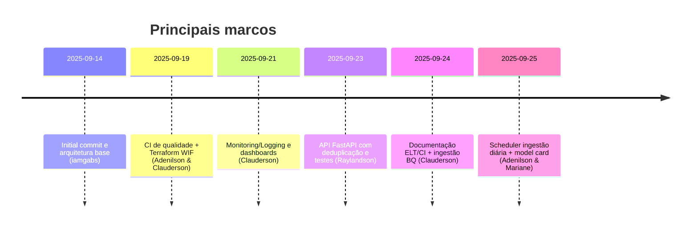
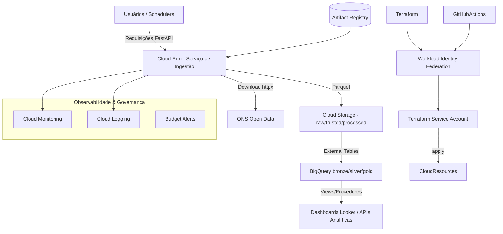
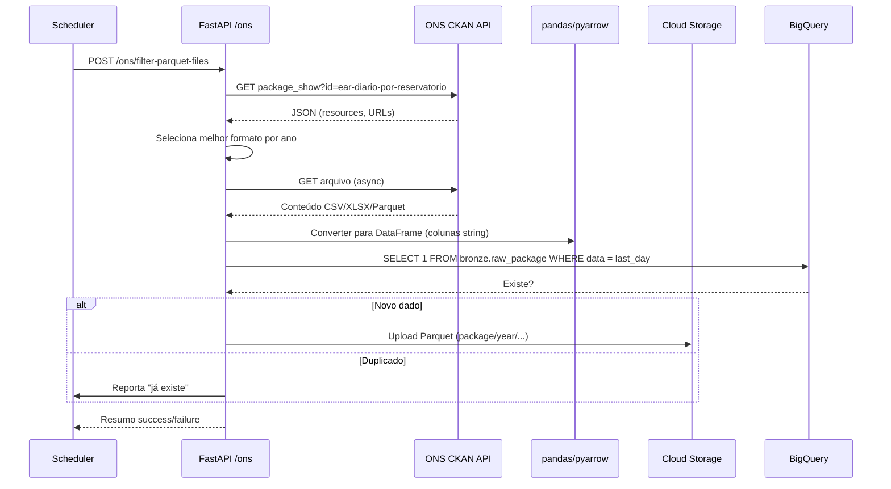
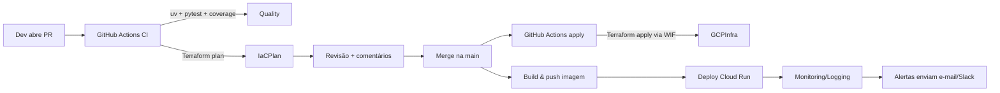
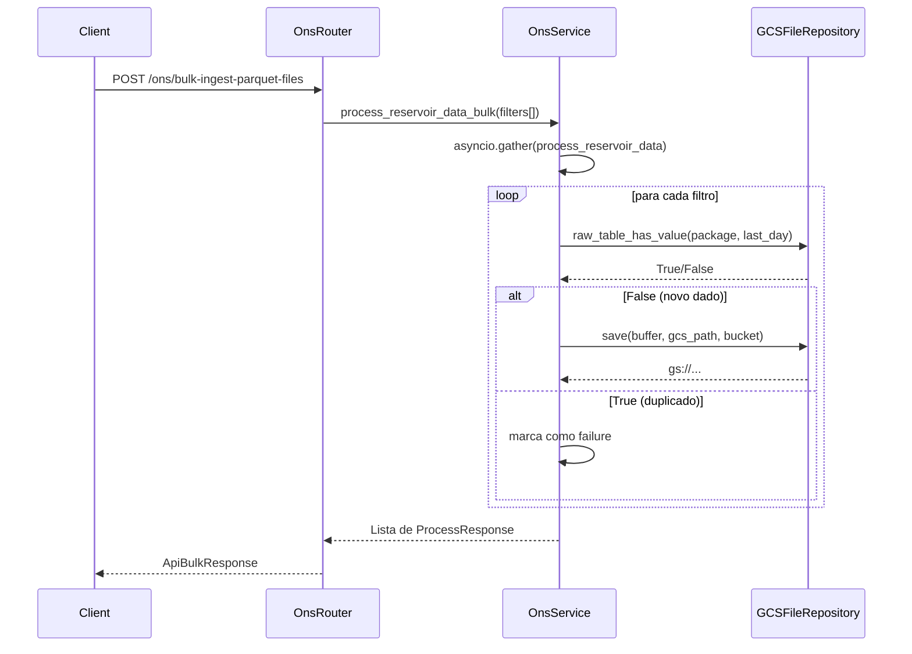

# 📚 Documentação Integrada — Sauter Challenger 2025

---

## 1. Resumo executivo
- **Objetivo**: disponibilizar uma plataforma de dados e ML na Google Cloud capaz de ingerir séries históricas de ENA do ONS, expor APIs REST, treinar modelos e prover dashboards analíticos, mantendo observabilidade, governança e FinOps.
- **Stack principal**: Terraform + GCP (GCS, BigQuery, Cloud Run, Monitoring, Budget), FastAPI + httpx + pandas, testes com pytest, lint com ruff/mypy e pipelines GitHub Actions autenticados via WIF.
- **Resultados-chave**:
  - Infraestrutura modulada por Terraform com deploy automatizado (CI plan / apply) e orçamento de R$300.
  - API de ingestão capaz de baixar dados por ano, converter para Parquet, deduplicar contra o BigQuery e armazenar no GCS.
  - Scripts SQL estruturando camadas raw/trusted/refined com procedures e views para Looker e ML.
  - Model card inicial do Trilho A e documentação PDF de CI/CD, ELT e dashboards.
  - Observabilidade habilitada (Monitoring dashboards, Cloud Logging, alertas) e runbooks de incidentes.

---

## 2. Casos de uso priorizados
| Prioridade | Caso de uso | Descrição | Métrica de sucesso |
|------------|-------------|-----------|--------------------|
| P0 | Ingestão diária ENA | Baixar arquivos ENA/Reservatórios do ONS, converter para Parquet e salvar em `raw`. | 100% dos arquivos novos armazenados sem duplicidade; tempo < 5 min/job. |
| P0 | Consulta histórica via API | Servir endpoints REST `/ons/filter-parquet-files` e `/ons/bulk-ingest-parquet-files`. | Resposta < 2s; status 2xx ≥ 99%. |
| P1 | Camadas BQ confiáveis | Promover dados raw → trusted → refined com procedures e views. | Jobs SQL idempotentes; zero falhas de DQ críticas. |
| P1 | Observabilidade & FinOps | Dashboards, logs centralizados, alertas de custo/saúde. | Alertas funcionando; orçamentos respeitados. |
| P2 | Modelo preditivo (Trilho A) | Treinar e versionar modelo ENA com ≥70% de acurácia. | MAE e RMSE dentro do baseline definido no model card. |
| P2 | Multi-agente (Trilho B) | Orquestrar agentes ADK + Gemini com RAG. | Respostas contextualizadas com citações (roadmap). |

---

## 3. Responsabilidades e histórico de contribuição
A tabela abaixo consolida as atividades com base nos commits registrados no repositório (datas UTC). Para detalhes, consulte o histórico `git log`.

| Pessoa | Período | Principais entregas | Commits de referência |
|--------|---------|---------------------|-----------------------|
| **Adenilson Ramos** | 18–25/09/2025 | Estruturação inicial do monorepo, configuração de IAM/WIF, módulos Terraform (Cloud Run, Artifact Registry, BigQuery, GCS), budgets e CI Terraform com WIF, merges finais das tasks de scheduler e ML. | `bad2cbc`, `b329175`, `c07151a`, `447c552`, `0d784dd`, `062791e`, `836ad8d` |
| **Clauderson Branco Xavier** | 19–25/09/2025 | Pipelines CI/CD (qualidade + deploy Cloud Run), documentação ELT e CI, criação de alertas/logging/dashboards, ajustes Terraform (budget labels, variáveis) e ingestão BQ. | `2c8b855`, `0d0d889`, `7a2210a`, `7853aaa`, `61c1156`, `eaed9ac` |
| **Raylandson Cesário** | 23–25/09/2025 | API FastAPI (routers, services, repositories), mudança para `uv`, testes extensivos, verificação de duplicidade no BQ, bulk ingest, ajustes Terraform de envs. | `d40ddba`, `6a0f7c2`, `b42b33d`, `f28da5b`, `d586b84`, `5e8d04c` |
| **Gabriel Carvalho (iamgabs)** | 14–17/09/2025 | Commit inicial, desenho de arquitetura e Docker Compose base. | `6fead53`, `fe56ce4`, `48ad4ac` |
| **Mariane Melo** | 22–25/09/2025 | Model card do modelo de previsão, suporte na revisão de tagging de custo e monitoring. | `dabcc4c`, `bc4e23b`, `08aa179` |
| **Filipe Tavares** | 23/09/2025 | Padrão repository e merge dos fluxos de ingestão com parquet local. | `c73d72f`, `43998bd` |

> **Observação**: datas e commits extraídos via `git log --author` com formato `%ad | %h | %s`.

### Linha do tempo


---

## 4. Diagramas

### 4.1 Arquitetura macro


### 4.2 Fluxo de dados detalhado


### 4.3 Pipeline de deploy (CI/CD)


### 4.4 Sequência de chamadas internas (bulk ingest)


---

## 5. Guia passo a passo de implementação

### 5.1 Pré-requisitos
- Conta no projeto **`sauter-university-challenger`** com papéis mínimos (`roles/viewer`, `roles/storage.admin`, `roles/run.admin`, `roles/bigquery.admin`, `roles/billing.costsManager`).
- Billing habilitado com budget de R$300 (já criado via Terraform).
- Ferramentas instaladas: `git`, `uv` (ou `pip`), `docker`, `docker-compose`, `terraform>=1.6`, `gcloud`.

### 5.2 Setup local
1. Clonar o repositório e criar `.env` a partir de [`src/api/.env.example`](../src/api/.env.example).
2. Ativar ambiente virtual (`uv venv` ou `python -m venv .venv`).
3. Instalar dependências da API: `uv pip install -r src/api/requirements.txt`.
4. Exportar credenciais GCP (JSON via variável `GOOGLE_CREDENTIALS_JSON` ou `gcloud auth application-default login`).

### 5.3 Execução local da API
```bash
docker-compose up --build
# ou, usando uvicorn diretamente
uvicorn src/api/main:app --reload --host 0.0.0.0 --port 8000
```
Verificar documentação em `http://localhost:8000/docs`.

### 5.4 Testes automatizados
- **Unitários/integração**: `pytest src/api/tests --maxfail=1 --disable-warnings -q`
- **Cobertura**: `pytest --cov=services --cov=repositories --cov-report=term-missing`
- **Lint**: `ruff check src/api`
- **Tipagem**: `mypy src/api`

### 5.5 Pipeline de dados (manual)
1. Executar ingestão via endpoint `/ons/filter-parquet-files` com payload:
   ```json
   {
     "package": "ear-diario-por-reservatorio",
     "start_year": 2023,
     "end_year": 2024,
     "bucket": "sauter-university-challenger-dev-raw"
   }
   ```
2. Verificar objetos no bucket `raw` (prefixo `package/year/...`).
3. Rodar scripts SQL (ordem):
   - `sql/BQ/raw/raw-*.sql`
   - `sql/BQ/trusted/trusted-*.sql`
   - `sql/BQ/refined/refined-*.sql`
   - Procedures em `sql/BQ/procedure/`
4. Validar views em `sql/BQ/query/` antes de expor ao Looker/ML.

### 5.6 Treino e avaliação (Trilho A)
1. Definir dataset de treino com vistas `query-refined-view-ml.sql`.
2. Utilizar notebooks/pipelines em `ml/training/` (a criar) seguindo o **Model Card** (`ml/specs/README.md`).
3. Registrar métricas (MAE, RMSE, MAPE) e thresholds no model registry.
4. Empacotar modelo em `ml/serving/` e publicar imagem no Artifact Registry.

### 5.7 Deploy contínuo
1. Abrir PR com mudanças. O workflow `.github/workflows/iac-dev.yaml` roda `terraform plan` e `pytest`.
2. Após merge na `main`, o pipeline aplica Terraform via WIF e dispara build/deploy (Cloud Run).
3. Monitorar logs em Cloud Logging e dashboards Looker.

### 5.8 Validação em produção
- Checar endpoint `/healthz` (quando implementado) e `/ons/...` com smoke tests.
- Verificar alertas de orçamento e SLOs nos dashboards.
- Confirmar ingestão diária concluída (scheduler + logs).

### 5.9 Rollback
- **Infra**: executar `terraform apply` com versão anterior do state (usar `terraform state show` ou recuperar plan aprovado).
- **Aplicação**: utilizar Cloud Run revisions → promover revisão anterior.
- **Dados**: restaurar arquivos Parquet usando versionamento do GCS ou recriar tabelas BQ a partir de snapshots.

---

## 6. Testes, métricas e validação

| Categoria | Entrada | Saída esperada | Métrica/Threshold |
|-----------|---------|----------------|-------------------|
| Testes unitários `src/api/tests/test_ons_service.py` | DTO com anos válidos e bucket customizado | `ProcessResponse.success_count >=1` | 100% dos cenários críticos passando |
| Testes de repositório `test_gcs_repository.py` | Mock de tabelas BQ inexistentes | `raw_table_has_value == False` | Nenhum acesso real a GCP em testes |
| Endpoint `/ons/filter-parquet-files` | Ano com arquivo disponível | HTTP 200 + `success_count == total_processed` | Tempo resposta < 2s |
| Endpoint `/ons/bulk-ingest-parquet-files` | Lista 2 filtros | HTTP 200 + array de resultados | Concorrência sem exceções |
| Coverage | `pytest --cov` | ≥ 85% (meta definida no desafio) | Monitorar `src/api/tests/.coverage` |
| Data Quality | Scripts trusted/refined | Views sem null críticos | Verificar relatórios DQ (a criar) |

Datasets utilizados: ONS `ear-diario-por-reservatorio` e `reservatorio` (período 2000–2025). Registrar a versão do download diário no BigQuery (coluna `dt_coleta`).

Logs-chave: `utils/logger.log` gera mensagens com timestamp, arquivo e nível (INFO/DEBUG/ERROR). Utilize `LOG_LEVEL=INFO` para produção.

---

## 7. Observabilidade e runbook

### 7.1 Onde observar
- **Cloud Logging**: `projects/sauter-university-challenger/logs/run.googleapis.com%2Fstdout` (serviço `baseline-api`).
- **Dashboards Monitoring**: consulte `docs/documents/Dashboard_ACFMR.pdf` para captura dos gráficos (latência, erros, ingestão).
- **Alertas**: política configurada para erros HTTP e orçamento de R$300 (emails do Google Group da equipe).

### 7.2 Métricas principais
- Latência P95 e taxa de erro 5xx (Cloud Run).
- Volume diário de arquivos ingeridos (contador via logs).
- Consumo de budget (50/90/100%).

### 7.3 Runbook — incidentes comuns
| Sintoma | Diagnóstico | Ação corretiva |
|---------|-------------|----------------|
| API retornando 500 | Verificar logs em Cloud Logging (procure `Ocorreu um erro inesperado`). | Conferir variáveis de ambiente (`ONS_API_URL`, credenciais GCP); reimplantar serviço. |
| Dados duplicados no BQ | `ProcessResponse.failed_downloads` indicando "Data already exists". | Revisar janela de anos solicitada; se necessário, limpar partições duplicadas no `bronze.raw_*`. |
| Falha Terraform apply | Workflow `iac-dev` com erro em budget ou permissions. | Validar papéis da SA `terraform-deployer`; rodar `terraform plan` local para reproduzir. |
| Budget estourado | Notificação 100% do orçamento. | Pausar Cloud Run (escala para zero), suspender jobs/schedulers e revisar custos nos últimos 3 dias. |
| Falha no download ONS | Timeout ou 404 nos logs. | Confirmar disponibilidade da API do ONS e ajustar `REQUEST_TIMEOUT_SECONDS` se necessário. |

---

## 8. Segurança e conformidade
- **Segredos**: nunca commitar credenciais. Utilize variáveis de ambiente ou o Secret Manager (integração futura). `.env.example` publicado em [`src/api/.env.example`](../src/api/.env.example).
- **Permissões mínimas**: a Service Account `terraform-deployer` possui apenas papéis necessários (Storage Admin, Run Admin, BQ Admin, Billing Costs Manager). Revisar ao adicionar novos recursos.
- **WIF**: GitHub Actions usa Workload Identity Federation (sem chaves estáticas). Segredos `GCP_WIF_PROVIDER` e `GCP_TERRAFORM_SA` configurados no repositório.
- **Governança de dados**: buckets GCS com Versionamento + Uniform Bucket Level Access. BigQuery organizado em bronze/silver/gold para rastreabilidade.

---

## 9. Registro de decisões arquiteturais (ADR)

| Data | Decisão | Alternativas avaliadas | Responsável |
|------|---------|------------------------|-------------|
| 2025-09-19 | Autenticar CI/CD via WIF + Terraform SA | Uso de chaves JSON fixas no repositório; GitHub Secrets com chave longa | Adenilson Ramos |
| 2025-09-20 | FastAPI + httpx para ingestão assíncrona | Cloud Functions simples; scripts Cloud Run job | Raylandson Cesário |
| 2025-09-21 | Monitoring dedicado (dashboards + alertas) | Apenas logs básicos | Clauderson Xavier |
| 2025-09-23 | Deduplicação no BQ antes de salvar Parquet | Deduplicar somente via Dataform após ingestão | Raylandson Cesário |
| 2025-09-24 | Estrutura ELT raw→trusted→refined | Modelo único sem camadas | Clauderson Xavier |
| 2025-09-25 | Scheduler externo chamando API | Cloud Scheduler + Cloud Functions; Composer | Adenilson Ramos |

Registrar futuras decisões neste quadro.

---

## 10. Changelog

| Versão | Data | Descrição |
|--------|------|-----------|
| v0.3.0 | 2025-09-25 | Scheduler diário, bulk ingest, model card ML, documentação consolidada. |
| v0.2.0 | 2025-09-23 | API FastAPI com deduplicação, testes, mudança para `uv`, dashboards GCP. |
| v0.1.0 | 2025-09-19 | Estrutura Terraform (IAM, WIF, budgets), CI/CD, Docker Compose e arquitetura inicial. |

Versionar releases futuras seguindo semântica (major.minor.patch).

---

## 11. Links úteis
- Repositório GitHub: <https://github.com/sauter-university-challenge-ACFMV/sauter-university-2025-challenge>
- Pipelines CI/CD: `.github/workflows/iac-dev.yaml`
- PDFs técnicos: `docs/documents/CI_CD-Documentação-Técnica.pdf`, `docs/documents/ELT no BigQuery-Documentação-Técnica.pdf`, `docs/documents/Dashboard_ACFMR.pdf`
- APIs de referência ONS: <https://dados.ons.org.br/dataset/ear-diario-por-reservatorio>
- Documentação oficial da Sauter University.

---

> Última atualização: 25/09/2025.
